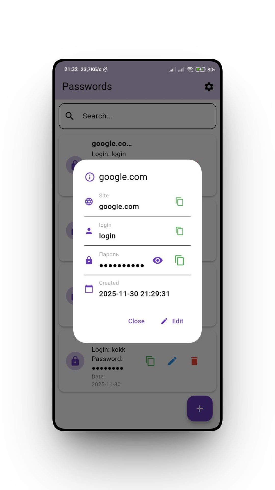
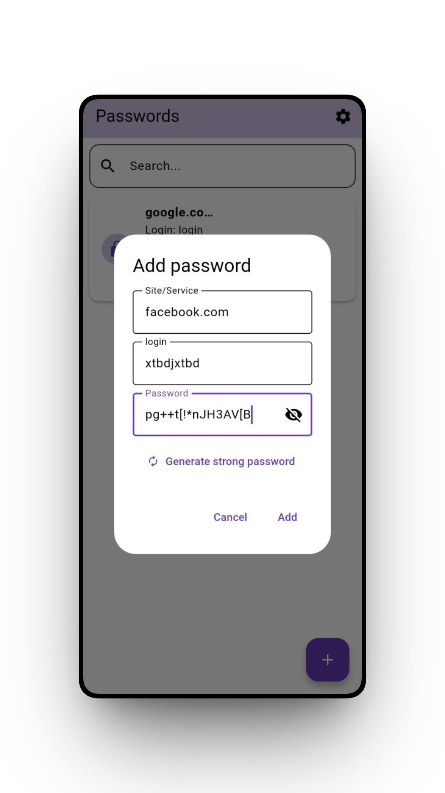

# 🔐 Password Manager

A simple and secure password manager built with Flutter.


## ✨ Key Features

* 🔒 **AES-256 Encryption** – military-grade data protection
* 📱 **PIN Code** – fast and secure access
* 🎨 **Dark/Light Theme** – choose a comfortable look
* 🔍 **Search** – quickly find saved passwords
* 📋 **One-tap Copy** – fast clipboard copying
* 🎲 **Password Generator** – create strong 16-character passwords
* 💾 **Database Export** – create backup copies
* 🎯 **Local Storage Only** – all data stays on your device

## 📸 Screenshots

<table>
  <tr>
    <td align="center">
      
      <br>
      <b>PIN Login</b>
    </td>
    <td align="center">
      
      <br>
      <b>Password List</b>
    </td>
    <td align="center">
      
      <br>
      <b>Password Details</b>
    </td>
  </tr>
  <tr>
    <td align="center">
      
      <br>
      <b>Add Password</b>
    </td>
    <td align="center">
      
      <br>
      <b>Settings</b>
    </td>
    <td align="center">
      
      <br>
      <b>Dark Theme</b>
    </td>
  </tr>
</table>

## 🚀 Getting Started

### Prerequisites

* Flutter SDK (3.0+)
* Dart SDK (3.0+)
* Android Studio / Xcode
* Android/iOS device or emulator

### Installation

1. **Clone the repository**

```bash
git clone https://github.com/yourusername/password_manager.git
cd password_manager
```

2. **Install dependencies**

```bash
flutter pub get
```

3. **Run the app**

```bash
flutter run
```

## 🏗️ Project Architecture

```
lib/
├── main.dart                           # Entry point
├── models/
│   └── password_entry.dart             # Password data model
├── screens/
│   ├── pin_screen.dart                 # PIN login screen
│   ├── home_screen.dart                # Home screen
│   └── settings_screen.dart            # Settings
├── services/
│   ├── database_service.dart           # SQLite operations
│   ├── encryption_service.dart         # AES-256 encryption
│   ├── password_generator_service.dart # Password generator
│   └── pin_service.dart                # PIN management
└── theme/
    └── theme_provider.dart             # Theme management
```

## 🔐 Security

### Encryption

* **Algorithm**: AES-256-CBC (Advanced Encryption Standard)
* **Mode**: Cipher Block Chaining with a unique IV per entry
* **Key**: 256-bit cryptographically secure random key
* **Key Storage**: Flutter Secure Storage (Keychain on iOS, KeyStore on Android)

### PIN Code

* **Hashing**: SHA-256
* **Storage**: Flutter Secure Storage
* **Length**: 4 digits

### Data Protection

```dart
// Encryption example
Future<String> encryptPassword(String plainText) async {
  final iv = encrypt.IV.fromSecureRandom(16);
  final encrypted = encrypter.encrypt(plainText, iv: iv);
  return '${iv.base64}:${encrypted.base64}'; // IV stored together with ciphertext
}
```

## 📦 Technologies Used

### Main Packages

| Package                  | Version | Purpose               |
| ------------------------ | ------- | --------------------- |
| `flutter`                | SDK     | UI framework          |
| `sqflite`                | ^2.3.3  | Local SQLite database |
| `encrypt`                | ^5.0.1  | AES encryption        |
| `flutter_secure_storage` | ^9.0.0  | Secure key storage    |
| `provider`               | ^6.1.1  | State management      |
| `shared_preferences`     | ^2.2.2  | Settings storage      |
| `crypto`                 | ^3.0.3  | PIN hashing           |
| `path_provider`          | ^2.1.1  | File system paths     |
| `uuid`                   | ^4.2.1  | Unique ID generation  |

### Full List

See [pubspec.yaml](pubspec.yaml)

## 💡 Usage

### First Launch

1. **Set a PIN** – create a 4-digit code on first run
2. **Add a password** – tap the bottom **+** button
3. **Fill in the fields**:

   * Website/Service name
   * Username
   * Password (or generate one automatically)

### Working with Passwords

**Quick Copy**

* Tap the green 📋 button → password copied

**Detailed View**

* Tap an item → dialog opens
* 👁️ Show/Hide password
* 📋 Copy site/username/password
* ✏️ Edit entry

**Search**

* Type website name or username in the search field

### Settings

**Theme Switch**

* Settings → Dark Theme → toggle

**Change PIN**

* Settings → Change PIN
* Enter old PIN → new PIN → confirm

**Export Database**

* Settings → Export Database
* File is saved to `ApplicationDocumentsDirectory`

**Clear All Passwords**

* Settings → Clear All Passwords
* ⚠️ Irreversible action!

## 🛠️ Development

### Database Structure

```sql
CREATE TABLE passwords (
  id TEXT PRIMARY KEY,
  site TEXT NOT NULL,
  username TEXT NOT NULL,
  encrypted_password TEXT NOT NULL,
  createdAt TEXT NOT NULL
);
```

## 🐛 Known Issues

* ⚠️ All data is lost when uninstalling the app (local storage only)
* ⚠️ No cross-device synchronization
* ⚠️ Exported DB is not additionally encrypted

---

<div align="center">

**Made with ❤️ and Flutter**

   /\_/\
  ( o.o )
   > ^ <

</div>
